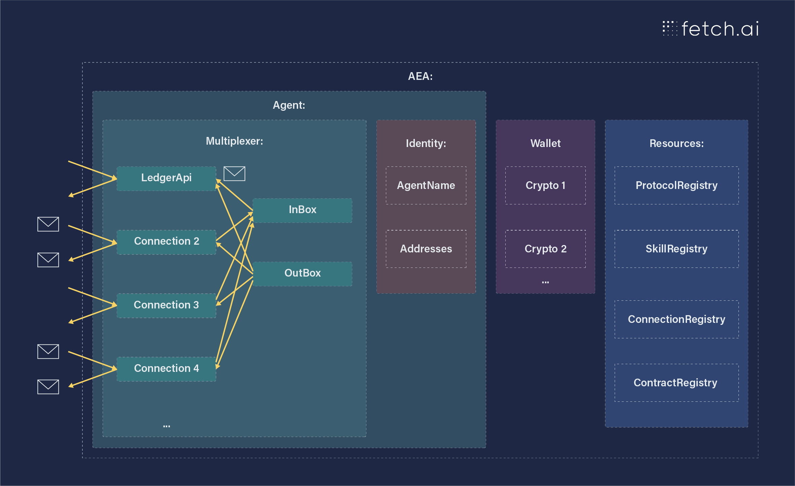

AEAs are more than just agents.

<center></center>

In this guide we show some of the differences in terms of code.

The <a href="../build-aea-programmatically">Build an AEA programmatically</a> guide shows how to programmatically build an AEA. We can build an agent of the `Agent` class programmatically as well.

First, import the python and application specific libraries.
``` python
import os
import time
from threading import Thread
from typing import List, Optional

from aea.agent import Agent, Identity
from aea.connections.base import Connection
from aea.connections.stub.connection import StubConnection
from aea.mail.base import Envelope
```

Unlike an `AEA`, an `Agent` does not require a `Wallet`, `LedgerApis` or `Resources` module.

However, we need to implement 5 abstract methods:
- `setup()`
- `act()`
- `react()`
- `update()`
- `teardown()`


When we run an agent, `start()` calls `setup()` and then the main agent loop. The main agent loop calls `act()`, `react()` and `update()` on each tick. When the agent is stopped via `stop()` then `teardown()` is called.

Such a lightweight agent can be used to implement simple logic.

## Code an `Agent`

We define our `Agent` which simply receives envelopes, prints the sender address and protocol_id and returns it unopened.
```python
INPUT_FILE = "input.txt"
OUTPUT_FILE = "output.txt"


class MyAgent(Agent):
    def __init__(self, name: str, connections: List[Connection]):
        super().__init__(name, connections)

    def setup(self):
        pass

    def act(self):
        print("Act called for tick {}".format(self.tick))

    def react(self):
        print("React called for tick {}".format(self.tick))
        while not self.inbox.empty():
            envelope = self.inbox.get_nowait()  # type: Optional[Envelope]
            if envelope is not None:
                sender = envelope.sender
                receiver = envelope.to
                envelope.to = sender
                envelope.sender = receiver
                print(
                    "Received envelope from {} with protocol_id={}".format(
                        sender, envelope.protocol_id
                    )
                )
                self.outbox.put(envelope)

    def update(self):
        print("Update called for tick {}".format(self.tick))

    def teardown(self):
        pass
```

## Instantiate an `Agent`

``` python
# Ensure the input and output files do not exist initially
if os.path.isfile(INPUT_FILE):
    os.remove(INPUT_FILE)
if os.path.isfile(OUTPUT_FILE):
    os.remove(OUTPUT_FILE)

# Set up the stub connection
stub_connection = StubConnection(
    input_file_path=INPUT_FILE, output_file_path=OUTPUT_FILE
)

# Create our Agent
identity = Identity("my_agent")
my_agent = MyAgent(identity, [stub_connection])
```

## Start the agent
We run the agent from a different thread so that we can still use the main thread to pass it messages.
``` python
# Set the agent running in a different thread
t = Thread(target=my_agent.start)
t.start()

# Wait for everything to start up
time.sleep(3)
```

## Send and receive an envelope
We use the input and output text files to send an envelope to our agent and receive a response
``` python
# Create a message inside an envelope and get the stub connection to pass it into the agent
message_text = 'my_agent,other_agent,fetchai/default:0.1.0,{"type": "bytes", "content": "aGVsbG8="}'
with open(INPUT_FILE, 'w') as f:
    f.write(message_text)

# Wait for the envelope to get processed
time.sleep(2)

# Read the output envelope generated by the agent
with open(OUTPUT_FILE, 'r') as f:
    print("output message: " + f.readline())
```

## Shutdown
Finally stop our agent and wait for it to finish
``` python
# Shut down the agent
my_agent.stop()
t.join()
```

## Your turn

Now it is your turn to develop a simple agent with the `Agent` class.

## Entire code listing
If you just want to copy and paste the entire script in you can find it here:

<details><summary>Click here to see full listing</summary>
<p>

```python
import os
import time
from threading import Thread
from typing import List, Optional

from aea.agent import Agent, Identity
from aea.connections.base import Connection
from aea.connections.stub.connection import StubConnection
from aea.mail.base import Envelope


INPUT_FILE = "input.txt"
OUTPUT_FILE = "output.txt"


class MyAgent(Agent):
    def __init__(self, name: str, connections: List[Connection]):
        super().__init__(name, connections)

    def setup(self):
        pass

    def act(self):
        print("Act called for tick {}".format(self.tick))

    def react(self):
        print("React called for tick {}".format(self.tick))
        while not self.inbox.empty():
            envelope = self.inbox.get_nowait()  # type: Optional[Envelope]
            if envelope is not None:
                sender = envelope.sender
                receiver = envelope.to
                envelope.to = sender
                envelope.sender = receiver
                print(
                    "Received envelope from {} with protocol_id={}".format(
                        sender, envelope.protocol_id
                    )
                )
                self.outbox.put(envelope)

    def update(self):
        print("Update called for tick {}".format(self.tick))

    def teardown(self):
        pass


def run():
    # Ensure the input and output files do not exist initially
    if os.path.isfile(INPUT_FILE):
        os.remove(INPUT_FILE)
    if os.path.isfile(OUTPUT_FILE):
        os.remove(OUTPUT_FILE)

    # Set up the stub connection
    stub_connection = StubConnection(
        input_file_path=INPUT_FILE, output_file_path=OUTPUT_FILE
    )

    # Create our Agent
    identity = Identity("my_agent")
    my_agent = MyAgent(identity, [stub_connection])

    # Set the agent running in a different thread
    t = Thread(target=my_agent.start)
    t.start()

    # Wait for everything to start up
    time.sleep(3)

    # Create a message inside an envelope and get the stub connection to pass it into the agent
    message_text = 'my_agent,other_agent,fetchai/default:0.1.0,{"type": "bytes", "content": "aGVsbG8="}'
    with open(INPUT_FILE, "w") as f:
        f.write(message_text)

    # Wait for the envelope to get processed
    time.sleep(2)

    # Read the output envelope generated by the agent
    with open(OUTPUT_FILE, "r") as f:
        print("output message: " + f.readline())

    # Shut down the agent
    my_agent.stop()
    t.join()


if __name__ == "__main__":
    run()
```

<br />
