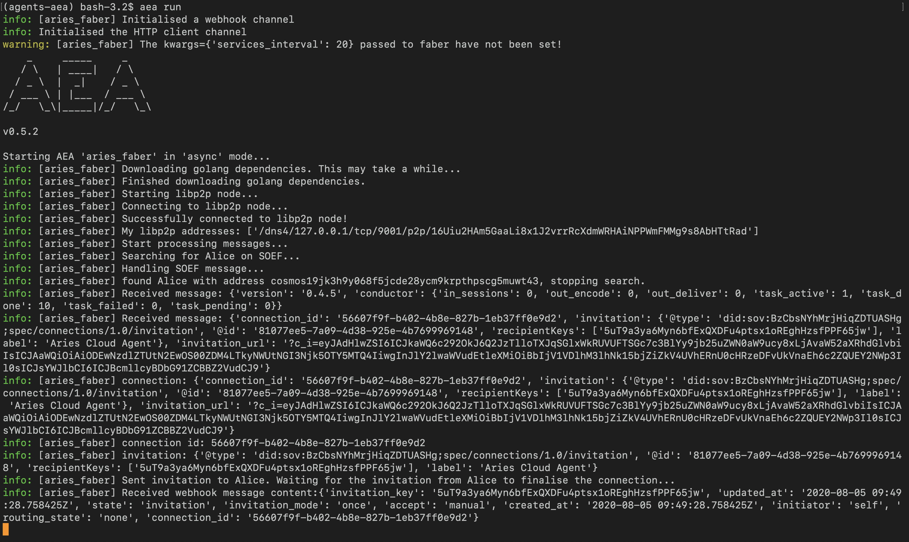
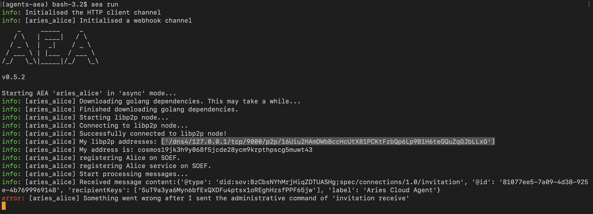

<div class="admonition note">
  <p class="admonition-title">Note</p>
  <p>This demo is incomplete and will soon be updated.
</p>
</div>

Demonstrating an entire decentralised identity scenario involving AEAs and instances of Aries Cloud Agents (ACAs).

## Discussion

This demo corresponds with the one <a href="https://github.com/hyperledger/aries-cloudagent-python/blob/master/demo/README.md" target=_blank>here</a> from <a href="https://github.com/hyperledger/aries-cloudagent-python" target=_blank> aries cloud agent repository </a>. 

There are two AEAs: 

 * Alice_AEA
 * Faber_AEA 

and two ACAs:

 * Alice_ACA
 * Faber_ACA
 
Each AEA is connected to its corresponding ACA: Alice_AEA to Alice_ACA and Faber_AEA to Faber_ACA.

The following lists the sequence of interactions between the four agents:

 * Alice_AEA: starts
 * Alice_AEA: shows its identity in the terminal and waits for an `invitation` detail from Faber_AEA.
 * Faber_AEA: starts
 * Faber_AEA: tests its connection to Faber_ACA.
 * Faber_ACA: responds to Faber_AEA.
 * Faber_AEA: requests Faber_ACA to create an invitation.
 * Faber_ACA: responds by sending back the `connection` detail, which contains an `invitation` field.
 * Faber_AEA: sends the `invitation` detail to Alice_AEA.
 * Alice_AEA: receives `invitation` detail from Faber_AEA.
 * Alice_AEA: requests Alice_ACA to accept the invitation, by passing it the `invitation` detail it received in the last step.

All messages from an AEA to an ACA are http requests (using `http_client` connection).

All messages from an AEA to another AEA are via the `oef` connection.

All messages initiated from an ACA to an AEA are webhooks (using `webhook` connection).

This is the extent of the demo, at this point. The rest of the interactions require an instance of the <a href="https://github.com/bcgov/von-network" target=_blank>Indy ledger</a> to run. This is what will be implemented next.

The rest of the interactions are broadly as follows:

 * Alice_ACA: accepts the invitation.
 * Alice_AEA: sends a matching invitation request to Faber_ACA.
 * Faber_ACA: accepts

At this point Alice_ACA and Faber_ACA are connected. 

 * Faber_AEA: issues a credential (e.g. university degree) to Alice_AEA, via Faber_ACA and Alice_ACA.
 * Faber_AEA: requests proof that Alice_AEA's age is above 18.
 * Alice_AEA: presents proof that it's age is above 18, without presenting its credential.       
 
The aim of this demo is to illustrate how AEAs can connect to ACAs, thus gaining all of their capabilities, such as issuing and requesting verifiable credential, selective disclosure and zero knowledge proof.

## Preparation Instructions

### Dependencies

Follow the <a href="../quickstart/#preliminaries">Preliminaries</a> and <a href="../quickstart/#installation">Installation</a> sections from the AEA quick start.

Install Aries cloud-agents (run `pip install aries-cloudagent` or see <a href="https://github.com/hyperledger/aries-cloudagent-python#install" target=_blank>here</a>) if you do not have it on your machine.

## Run Alice and Faber ACAs

Open four terminals. Each terminal will be used to run one of the four agents in this demo. 

### Run Faber_ACA

Type this in the first terminal:

``` bash
aca-py start --admin 127.0.0.1 8021 --admin-insecure-mode --inbound-transport http 0.0.0.0 8020 --outbound-transport http --webhook-url http://127.0.0.1:8022/webhooks
```

Make sure the above ports are unused. To learn more about the above command for starting an aca and its various options: 

``` bash
aca-py start --help
```

Take note of the specific IP addresses and ports you used in the above command. We will refer to them by the following names: 

* Faber admin IP: 127.0.0.1
* Faber admin port: 8021
* Faber webhook port: 8022

The admin IP and port will be used to send administrative commands to this ACA from an AEA. 

The webhook port is where the ACA will send notifications to. We will expose this from the AEA so it receives this ACA's notifications.

### Run Alice_ACA

Type this in the second terminal:

``` bash
aca-py start --admin 127.0.0.1 8031 --admin-insecure-mode --inbound-transport http 0.0.0.0 8030 --outbound-transp http --webhook-url http://127.0.0.1:8032/webhooks
```

Again, make sure the above ports are unused and take note of the specific IP addresses and ports. In this case:

* Alice admin IP: 127.0.0.1
* Alice admin port: 8031
* Alice webhook port: 8032

## Create Alice and Faber AEAs

### Create Alice_AEA

In the third terminal, create an Alice_AEA and move into its project folder: 

``` bash
aea create alice
cd faber
```

### Add and Configure the Skill

Add the `aries_alice` skill:

``` bash
aea add --local skill fetchai/aries_alice:0.1.0
```

You then need to configure this skill. Open the skill's configuration file in `alice/vendor/fetchai/skills/aries_alice/skill.yaml` and ensure `admin_host` and `admin_port` details match those you noted above for Faber_ACA. 

### Add and Configure the Connections

Add `http_client`, `oef` and `webhook` connections:

``` bash
aea add --local connection fetchai/http_client:0.1.0
aea add --local connection fetchai/webhook:0.1.0
aea add connection fetchai/oef:0.1.0
```

You now need to configure the `webhook` connection. Open the connection's configuration file in `alice/vendor/fetchai/connections/webhook/connection.yaml` and ensure `webhook_port` matches with what you used above for Faber_ACA. 

Next, make sure that the value of `webhook_url_path` is `/webhooks/topic/{topic}/`.

### Configure Alice_AEA:

You now need to ensure that Alice_AEA uses the OEF connection as its default connection. Open the agent's configuration file in `alice/aea-config.yaml` and ensure that the `default_connection`'s value is `fetchai/oef:0.1.0`.

### Install the Dependencies and Run Alice_AEA:

Install the dependencies:

``` bash
aea install
```

Then run Alice_AEA:

``` bash
aea run --connections fetchai/http_client:0.1.0,fetchai/oef:0.1.0,fetchai/webhook:0.1.0
```

You should see Alice_AEA running and showing its identity on the terminal. For example:

``` bash
My address is: YrP7H2qdCb3VyPwpQa53o39cWCDHhVcjwCtJLes6HKWM8FpVK
```

Make note of this value. We will refer to this as Alice_AEA's address.

### Create Faber_AEA: 

In the fourth terminal, create a Faber_AEA and move into its project folder: 

``` bash
aea create faber
cd faber
```

### Add and Configure the Skill:

Add the `aries_faber` skill:

``` bash
aea add --local skill fetchai/aries_faber:0.1.0
```

You then need to configure this skill. Open the skill's configuration file in `faber/vendor/fetchai/skills/aries_alice/skill.yaml` and ensure `admin_host` and `admin_port` details match those you noted above for Faber_ACA. In addition, make sure that the value of `alice_id` matches Alice_AEA's address as seen in the third terminal.

### Add and Configure the Connections:

Add `http_client`, `oef` and `webhook` connections:

``` bash
aea add --local connection fetchai/http_client:0.1.0
aea add --local connection fetchai/webhook:0.1.0
aea add connection fetchai/oef:0.1.0
```

You now need to configure the `webhook` connection. Open the connection's configuration file in `faber/vendor/fetchai/connections/webhook/connection.yaml` and ensure `webhook_port` matches with what you used above for Faber_ACA. 

Next, make sure that the value of `webhook_url_path` is `/webhooks/topic/{topic}/`.

### Configure Faber_AEA:

You now need to ensure that Faber_AEA uses the HTTP_Client connection as its default connection. Open the agent's configuration file in `faber/aea-config.yaml` and ensure that the `default_connection`'s value is `fetchai/http_client:0.1.0`.

### Install the Dependencies and Run Faber_AEA:

Install the dependencies:

``` bash
aea install
```

Then run the Faber_AEA:

``` bash
aea run --connections fetchai/http_client:0.1.0,fetchai/oef:0.1.0,fetchai/webhook:0.1.0
```

You should see Faber_AEA running and showing logs of its activities. For example: 

<center></center>

Looking now at the Alice_AEA terminal, you should also see more activity by Alice_AEA, after Faber_AEA was started. For example:

<center></center>

The last error line in Alice_AEA terminal is caused due to the absence of an Indy ledger instance. In the next update to this demo, this will be resolved.

## Terminate and Delete the Agents

You can terminate each agent by pressing Ctrl+C. 

To delete the AEAs, go to its project's parent directory and delete the AEA:

``` bash
aea delete faber
aea delete alice
``` 