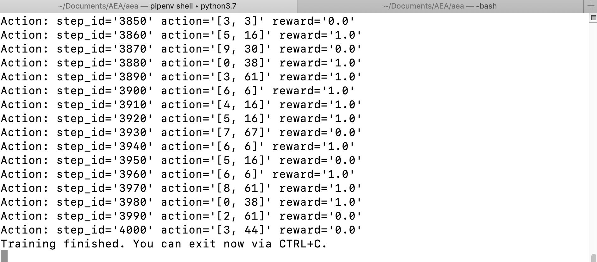

The AEA gym skill demonstrates how a custom Reinforcement Learning agent, that uses OpenAI's <a href="https://gym.openai.com" target=_blank>gym</a> library, may be embedded into an AEA skill and connection.


## Preparation instructions

### Dependencies

Follow the <a href="../quickstart/#preliminaries">Preliminaries</a> and <a href="../quickstart/#installation">Installation</a> sections from the AEA quick start.

## Demo instructions

### Create the AEA
In the root directory, create the gym AEA and enter the project.
``` bash
aea create my_gym_aea
cd my_gym_aea
```

### Add the gym skill 
``` bash
aea add skill fetchai/gym:0.1.0
```

### Copy the gym environment to the AEA directory
``` bash
mkdir gyms
cp -a ../examples/gym_ex/gyms/. gyms/
```

### Add a gym connection
``` bash
aea add connection fetchai/gym:0.1.0
```

### Update the connection config
``` bash
aea config set vendor.fetchai.connections.gym.config.env 'gyms.env.BanditNArmedRandom'
```

### Install the skill dependencies

To install the `gym` package, a dependency of the gym skill, from Pypi run
``` bash
aea install
```

### Run the AEA with the gym connection

``` bash
aea run --connections fetchai/gym:0.1.0
```

You will see the gym training logs.


<center></center>


### Delete the AEA

When you're done, you can go up a level and delete the AEA.

``` bash
cd ..
aea delete my_gym_aea
```

## Communication
This diagram shows the communication between the AEA and the gym environment 

<div class="mermaid">
    sequenceDiagram
        participant AEA
        participant Environment
    
        activate AEA
        activate Environment
        AEA->>Environment: reset
        loop learn
            AEA->>Environment: act
            Environment->>AEA: percept
        end
        AEA->>Environment: close
        
        deactivate AEA
        deactivate Environment
</div>

<br/>
