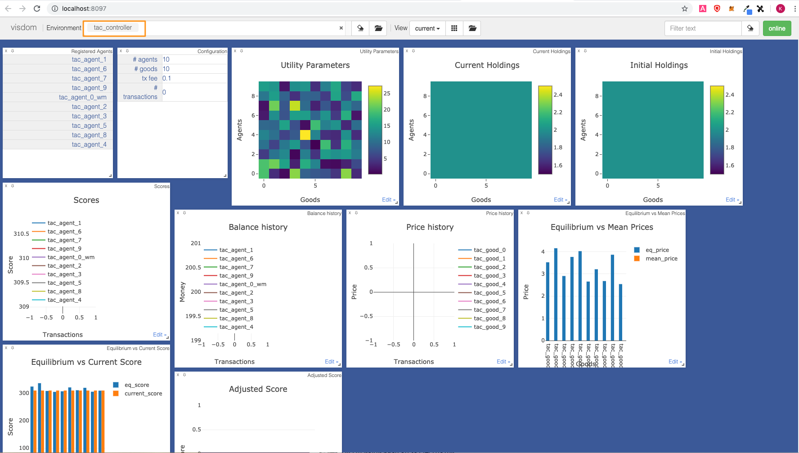

## Requirements

Make sure you are running <a href="https://docs.docker.com/install/" target=_blank>Docker</a> and <a href="https://docs.docker.com/compose/install/" target=_blank>Docker Compose</a>.


## Quick start

Clone the repo to include submodules.

``` bash
git clone git@github.com:fetchai/agents-tac.git --recursive && cd agents-tac
```


Create and launch a virtual environment.

``` bash
pipenv --python 3.7 && pipenv shell
```

Install the dependencies.

``` bash
pipenv install
```


Install the package.
``` bash
python setup.py install
```


Install Docker and Docker Compose - for now.

``` bash
pip install docker docker-compose
```


Run the launch script.

``` bash
python scripts/launch_alt.py
```

The <a href="https://github.com/facebookresearch/visdom" target="_blank">visdom</a> server is now running.

The controller GUI at <a href="http://localhost:8097" target=_blank>http://localhost:8097</a> provides real time insights.

In the Environment tab, make sure you have the `tac_controller` environment selected.

<center></center>


## Alternative build and run - WIP

In a new terminal window, clone the repo, build the sandbox, and launch it.

``` bash
git clone git@github.com:fetchai/agents-tac.git --recursive && cd agents-tac
pipenv --python 3.7 && pipenv shell
python setup.py install
cd sandbox && docker-compose build
docker-compose up
```

In a new terminal window, enter the virtual environment, and connect a template agent to the sandbox.

``` bash
pipenv shell
python templates/v1/basic.py --name my_agent --dashboard
```

Click through to the <a href="http://localhost:8097" target="_blank">controller GUI</a>.


## Flask installation


## Possible gotchas

Kill all running containers before restart.

``` bash
docker kill $(docker ps -q)
# mac
docker ps -q | xargs docker stop ; docker system prune -a
```

!!!	Note
	Checkout `develop` until further notice. Then run `pull` and `pullall`.
	


<br/>